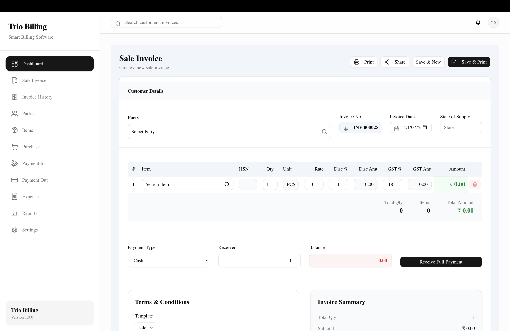
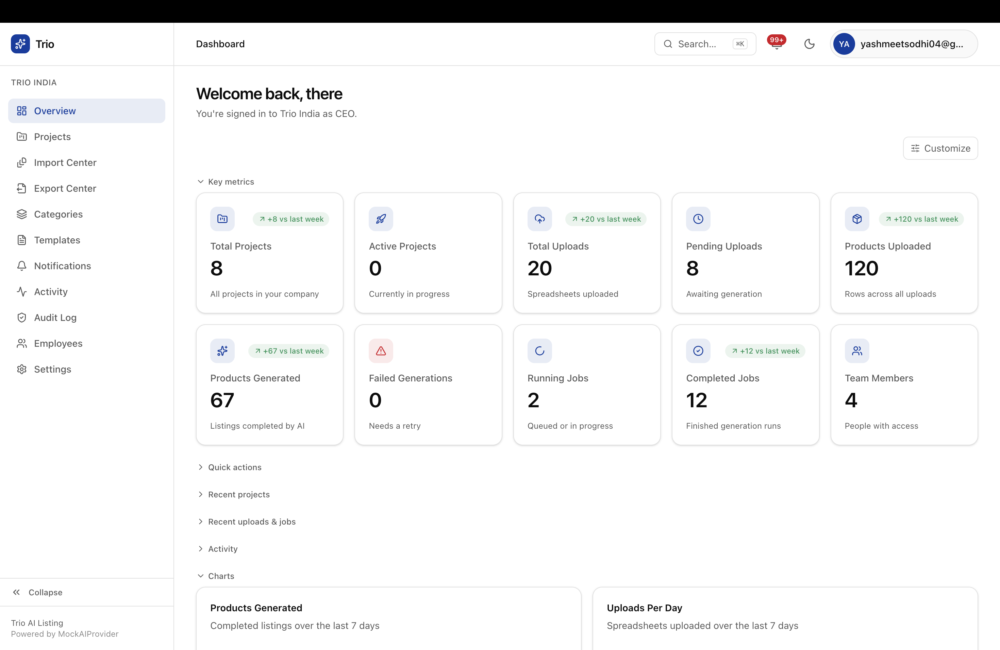
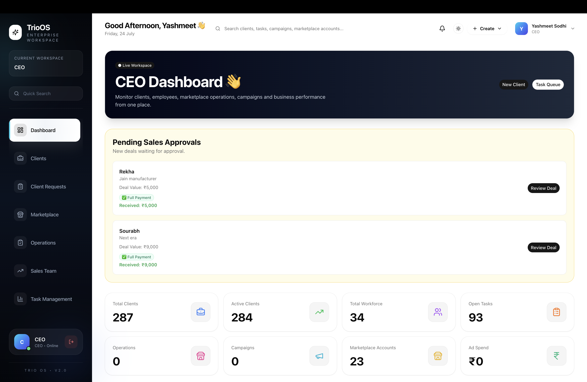
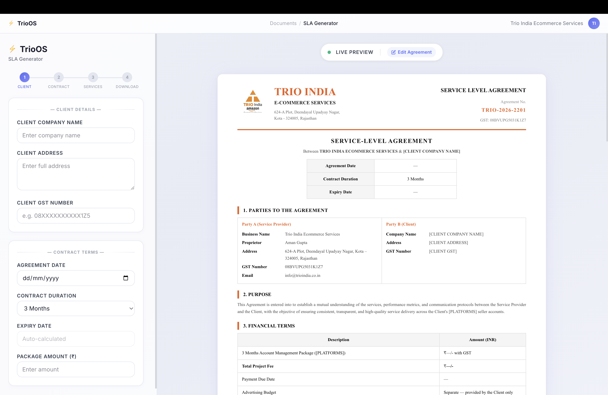

 

  

### <i>"I build the software I once had to work around."</i>

FULL STACK DEVELOPER · TRIO INDIA E-COMMERCE &nbsp;&nbsp;|&nbsp;&nbsp; B.TECH CSE · MANIPAL UNIVERSITY JAIPUR &nbsp;&nbsp;|&nbsp;&nbsp; RAJASTHAN, INDIA

  

  

PRODUCTS

<h1>TrioOS</h1>

AI-powered ERP for digital marketing agencies — clients, employees, campaigns, and marketplace operations in one workspace.

<code>Next.js</code> <code>TypeScript</code> <code>Supabase</code> &nbsp; 

  

  

<h1>Trio Billing</h1>

A production-grade GST billing SaaS for Indian businesses — invoicing, inventory, and A4-ready document generation.

<code>Next.js 16</code> <code>React 19</code> <code>shadcn/ui</code> &nbsp; 

  

  

<h1>Trio AI Listing</h1>

An AI-powered Amazon listing generator that automates product content creation and bulk listing generation at scale.

<code>OpenAI API</code> <code>Gemini API</code> <code>Automation</code> &nbsp; 

  

  

<h1>SLA Generator</h1>

A platform-specific SLA document generator for Amazon, Flipkart, and Meesho sellers, with automated filtering and export.

<code>React</code> <code>Vite</code> <code>Vercel</code> &nbsp; 

 

  

  

  

STACK

  

**FRONTEND**

 

**BACKEND**

 

**DATABASE**

 

**AI**

  

**TOOLS**

  

  

ANALYTICS

  

  

  

<picture>
  <source media="(prefers-color-scheme: dark)" srcset="https://raw.githubusercontent.com/itsyashmeet/itsyashmeet/output/github-contribution-grid-snake-dark.svg">
  <source media="(prefers-color-scheme: light)" srcset="https://raw.githubusercontent.com/itsyashmeet/itsyashmeet/output/github-contribution-grid-snake.svg">
  
</picture>

  

<h2><b>Let's build something amazing.</b></h2>

&nbsp;

&nbsp;

