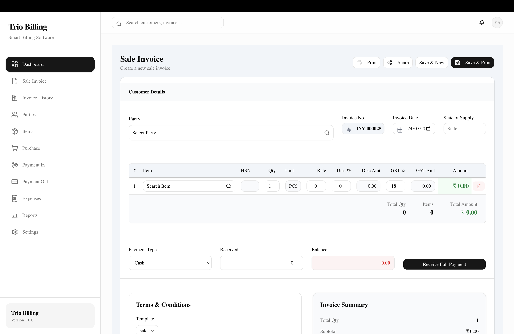
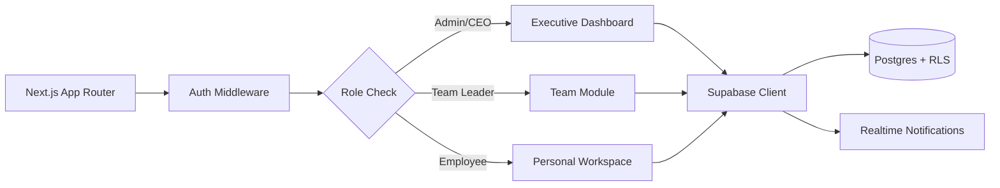
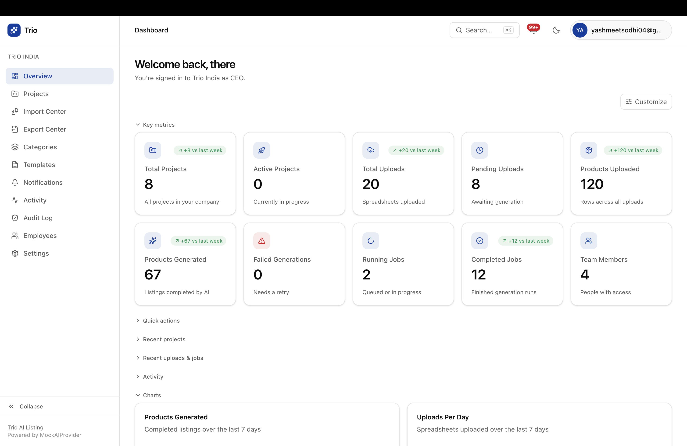
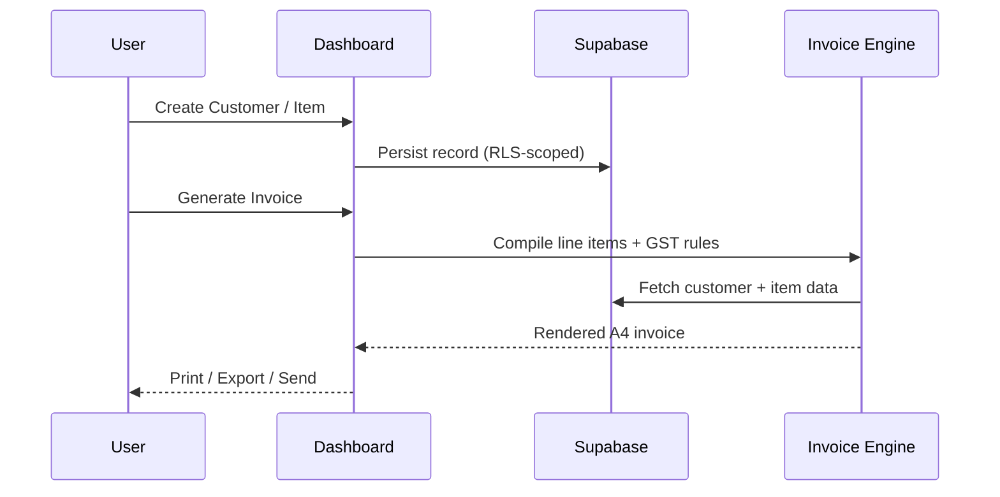
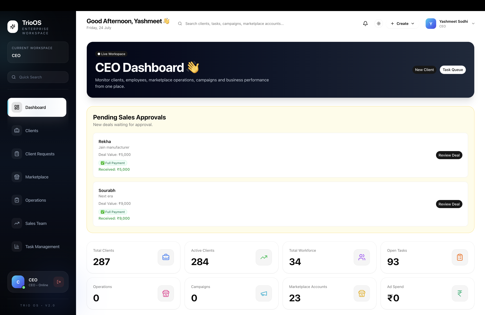
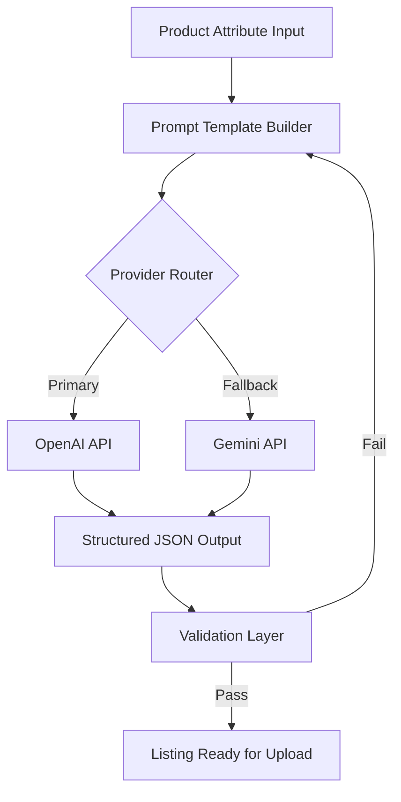
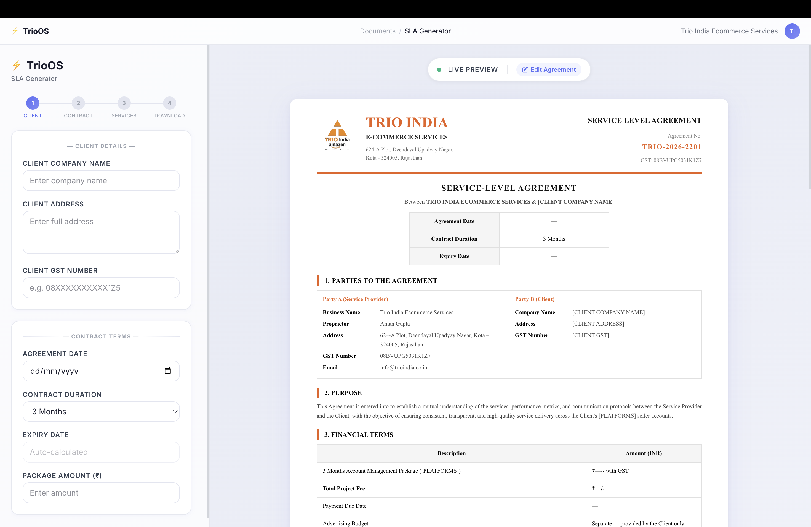
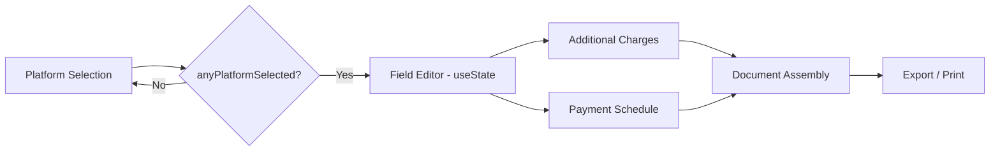
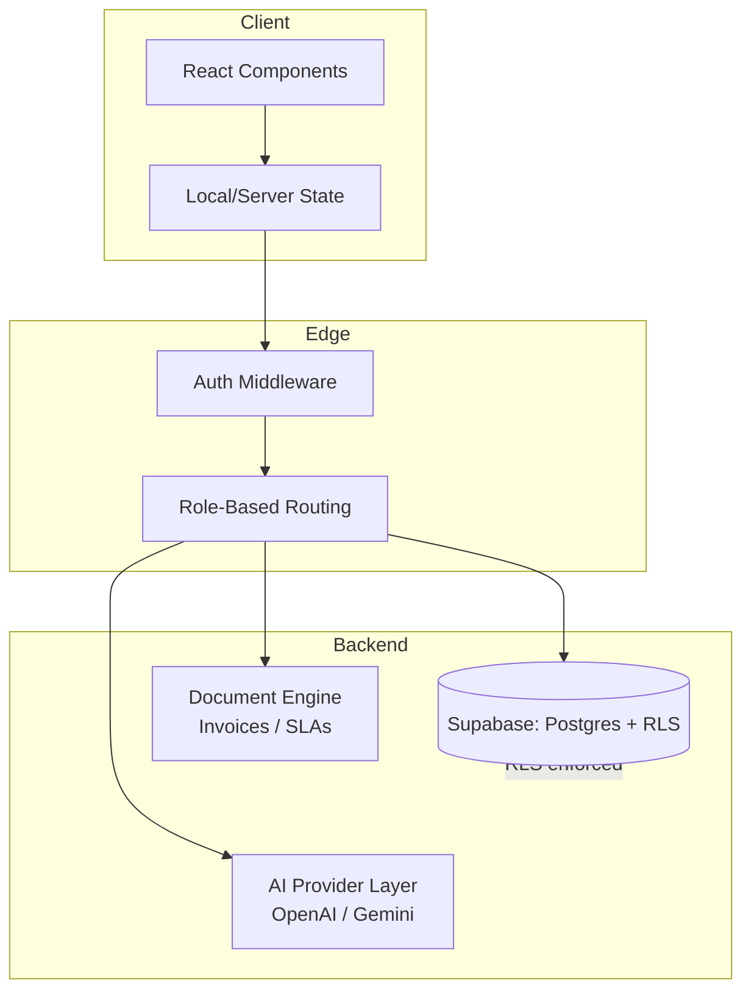
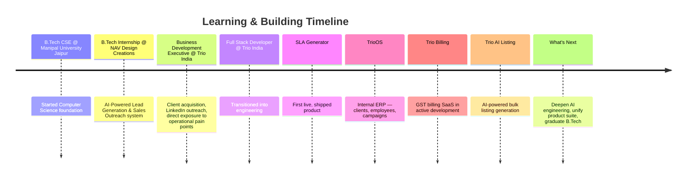

 

  

### <i>"I build the software I once had to work around."</i>

FULL STACK DEVELOPER · TRIO INDIA E-COMMERCE &nbsp;&nbsp;|&nbsp;&nbsp; B.TECH CSE · MANIPAL UNIVERSITY JAIPUR &nbsp;&nbsp;|&nbsp;&nbsp; RAJASTHAN, INDIA

  

  

ABOUT ME

<h1>Who I Am</h1>

I'm Yashmeet — a full stack developer at **Trio India E-Commerce Services**, a digital marketing and e-commerce agency in Kota, Rajasthan that serves D2C brands and marketplace sellers across Amazon, Flipkart, Meesho, and Myntra. I started at the company on the business-development side, which turned out to be the best possible training ground for the engineer I am now: I watched account managers fight the same manual, error-prone workflows every single day — SLA documents typed from scratch, invoices built in spreadsheets, Amazon listings written one field at a time — and instead of just living with it, I started building the software to replace it.

That's still the core of how I think about engineering. I don't build features in the abstract; I build them because someone on the other side of the company is currently doing something painful by hand, and the fastest way to help them is a well-designed tool, not another workaround.

**Engineering philosophy** — production-first, not portfolio-first. Every internal tool I ship is expected to survive real client data, real edge cases, and real deadlines on day one. I'd rather spend an extra day getting the data model right than ship something fast that breaks under the first messy CSV import.

**Areas of expertise:**
- Full-stack product engineering with Next.js, TypeScript, and Supabase
- Internal business tooling / lightweight ERP systems for agencies and SMBs
- AI-assisted content generation pipelines (OpenAI, Gemini) for e-commerce
- Document generation systems (invoices, SLAs, proposals) with strict formatting requirements
- Marketplace operations tooling for Amazon, Flipkart, and Meesho sellers

**Current role:** Full Stack Developer at Trio India (previously Business Development Executive — the transition gave me a rare amount of direct context on what these tools actually need to do).

**Current focus:** Shipping three internal/commercial products in parallel — TrioOS, Trio Billing, and Trio AI Listing — while finishing my B.Tech in Computer Science at Manipal University Jaipur.

**Career objective:** To keep building software that removes real operational friction for small and mid-sized businesses, and to grow into a role where I'm architecting systems end-to-end — not just implementing screens, but owning the data model, the AI layer, and the deployment pipeline underneath them.

 

  

FEATURED ACHIEVEMENTS
<h1>🚀 Highlights</h1>

- 🧱 Built **4 production software products** for a live digital marketing agency
- 🤖 Shipped an **AI-powered Amazon Listing Generator** using structured-output prompting
- 🏢 Designed and built an **ERP for a digital marketing agency** (TrioOS) — clients, employees, campaigns
- 🧾 Built a **GST Billing SaaS** for Indian businesses from the schema up
- ⚙️ Core stack: **React · Next.js · TypeScript · Supabase**
- 🔌 Integrated **AI providers (OpenAI & Gemini)** into production content pipelines

 

  

CURRENT FOCUS
<h1>What I'm Building Right Now</h1>

| Area | Details |
|---|---|
| 🧱 **SaaS Products** | Building [TrioOS](#trioos) and [Trio Billing](#trio-billing) in parallel — an internal ERP and a GST billing SaaS, both on Next.js + Supabase |
| 🤖 **AI Engineering** | Designing structured-output pipelines for [Trio AI Listing](#trio-ai-listing) using the OpenAI and Gemini APIs for bulk Amazon listing generation |
| 🛒 **Marketplace Automation** | Automating SLA documents, listing content, and lead-data processing for Amazon, Flipkart, and Meesho sellers |
| 📚 **Currently Learning** | Deepening Next.js 16 / React 19 patterns, Supabase RLS and edge functions, and more rigorous prompt-engineering techniques for structured AI output |
| 🗺️ **Roadmap** | Consolidating TrioOS and Trio Billing under a shared design system, and hardening Trio AI Listing for higher-volume bulk generation |

<table>
<tr>
<td valign="top" width="50%">

**Currently Building**
- ✔ TrioOS ERP
- ✔ Trio Billing SaaS
- ✔ Trio AI Listing

</td>
<td valign="top" width="50%">

**Currently Learning**
- ✔ Agentic AI
- ✔ MCP (Model Context Protocol)
- ✔ Multi-agent systems
- ✔ Advanced RAG

</td>
</tr>
</table>

 

  

FEATURED PRODUCTS
<h1>What I've Built</h1>

 

<h1>TrioOS</h1>

AI-powered ERP for digital marketing agencies — clients, employees, campaigns, and marketplace operations in one workspace.

<code>Next.js</code> <code>TypeScript</code> <code>Supabase</code> &nbsp; 

  

 

**Overview**
TrioOS is Trio India's internal business management platform — the operational backbone of the agency. It replaces a patchwork of spreadsheets and chat threads with a single workspace covering clients, employees, campaigns, and marketplace operations.

**Problem Statement**
As Trio grew across multiple marketplaces and client accounts, there was no single source of truth. Client details lived in one sheet, employee performance in another, and there was no structured way to track who was responsible for what — or how well they were performing.

**Solution**
A unified, role-aware platform with dedicated modules for clients, employees, and team leadership, built on Next.js and Supabase so the whole team works off live data instead of static exports.

**Core Features**
- Client detail pages with full account history
- Employee detail pages with a performance-scoring formula
- Team Leader role module for delegated oversight
- Client import pipeline (bulk onboarding via structured import modal)
- In-app notifications system
- Premium login experience with a split-panel, glassmorphism design
- Reusable dashboard primitives: `StatCard`, `ChartCard`, `ActivityCard`

**Tech Stack**
Next.js · TypeScript · Supabase (Postgres, Auth, Row-Level Security) · Tailwind CSS · shadcn/ui

**Architecture Overview**

```mermaid
flowchart LR
    A[Next.js App Router] --> B[Auth Middleware]
    B --> C{Role Check}
    C -->|Admin/CEO| D[Executive Dashboard]
    C -->|Team Leader| E[Team Module]
    C -->|Employee| F[Personal Workspace]
    D & E & F --> G[Supabase Client]
    G --> H[(Postgres + RLS)]
    G --> I[Realtime Notifications]
```

**Key Challenges Solved**
- Supabase foreign-key joins using `table!fkey` syntax were failing silently in production. The reliable fix was decomposing the query — fetching related rows separately and merging them manually in application code, rather than trusting the implicit join.
- A recurring "nested `DialogContent`" bug was breaking the Client Import modal; resolved by flattening the modal composition instead of nesting dialog primitives.
- TypeScript/Supabase type generation gaps required iterative, deliberate `as any` casting at well-documented boundaries rather than loosening types globally.

**Current Status**
Actively developed and in daily internal use at Trio India. Core modules (clients, employees, notifications, auth) are live; the Team Leader module and performance-scoring system are recent additions.

**Future Roadmap**
Expand campaign-tracking modules, unify the design system with Trio Billing, and move more of the reporting layer to real-time Supabase subscriptions.

 

 

<h1>Trio Billing</h1>

A production-grade GST billing SaaS for Indian businesses — invoicing, inventory, and A4-ready document generation.

<code>Next.js 16</code> <code>React 19</code> <code>shadcn/ui</code> &nbsp; 

  

 

**Overview**
Trio Billing is a standalone SaaS for GST-compliant invoicing, customer and item management, built specifically around the layout and tax conventions Indian businesses expect on a printed A4 invoice.

**Problem Statement**
Most generic billing tools either ignore Indian GST formatting conventions or produce documents that don't map cleanly to what a business actually wants to hand a customer or file with. Small businesses were stuck between spreadsheets and expensive enterprise software.

**Solution**
A focused, modern billing app: clean auth and dashboard shell first, then Customers, Items, and Invoices built as tightly-scoped milestones — each shippable and testable on its own.

**Core Features**
- Authenticated, protected dashboard with sidebar navigation
- Milestone-based build: Auth → Dashboard Shell → Customers → Items → Invoices
- `CompanyHeader` component for tax-invoice headers — flexbox layout, right-aligned contact block, vertical divider, matched pixel-for-pixel to a reference design
- GST-correct invoice formatting built for Indian tax compliance
- A4-ready print/export layouts

**Tech Stack**
Next.js 16 · React 19 · TypeScript · Tailwind CSS · shadcn/ui · Supabase

**Architecture Overview — Billing Workflow**

```mermaid
sequenceDiagram
    participant U as User
    participant D as Dashboard
    participant S as Supabase
    participant I as Invoice Engine
    U->>D: Create Customer / Item
    D->>S: Persist record (RLS-scoped)
    U->>D: Generate Invoice
    D->>I: Compile line items + GST rules
    I->>S: Fetch customer + item data
    I-->>D: Rendered A4 invoice
    D-->>U: Print / Export / Send
```

**Key Challenges Solved**
- Replicating a pixel-precise reference invoice header using pure flexbox (right-aligned contact details, vertical separators) without hardcoding fragile absolute positioning.
- Structuring the schema so Customers, Items, and Invoices could each ship as an independent milestone without rework once the next module landed.

**Current Status**
Milestone 1 complete — auth, middleware, and the protected dashboard/sidebar layout are live. Customers, Items, and Invoices are the active build targets.

**Future Roadmap**
Full invoice lifecycle (draft → sent → paid), inventory-aware item tracking, and PDF export aligned with the same document-generation standards used across Trio's other tools.

 

 

<h1>Trio AI Listing</h1>

An AI-powered Amazon listing generator that automates product content creation and bulk listing generation at scale.

<code>OpenAI API</code> <code>Gemini API</code> <code>Automation</code> &nbsp; 

  

 

**Overview**
Trio AI Listing turns raw product details into marketplace-ready Amazon listing content — titles, bullet points, and descriptions — at bulk scale, for Trio's D2C and marketplace-seller clients.

**Problem Statement**
Writing high-converting, policy-compliant Amazon listings by hand doesn't scale once an account manager is handling dozens of SKUs across multiple client catalogs. Manual listing content is slow, inconsistent, and easy to get wrong on formatting rules.

**Solution**
A structured AI pipeline that takes product attributes as input and returns marketplace-formatted listing content as structured output — not free-form text that needs manual cleanup — with both OpenAI and Gemini as interchangeable generation backends.

**Core Features**
- Bulk listing generation across many SKUs in one pass
- Structured-output prompting so results map directly into listing fields (no manual reformatting)
- Dual-provider AI backend (OpenAI + Gemini)
- Content tuned for Amazon's listing constraints and character limits

**Tech Stack**
OpenAI API · Gemini API · Automation/scripting layer

**Architecture Overview**

```mermaid
flowchart TD
    A[Product Attribute Input] --> B[Prompt Template Builder]
    B --> C{Provider Router}
    C -->|Primary| D[OpenAI API]
    C -->|Fallback| E[Gemini API]
    D & E --> F[Structured JSON Output]
    F --> G[Validation Layer]
    G -->|Pass| H[Listing Ready for Upload]
    G -->|Fail| B
```

**Key Challenges Solved**
- Getting consistent, structured output from a generative model reliably enough to skip manual review on every single listing — solved by strict prompt templating and output validation rather than trusting free-form generation.
- Designing prompts that respect Amazon's character-limit and formatting constraints without truncating mid-sentence.

**Current Status**
In active development as an internal tool supporting bulk listing workflows for Trio's marketplace clients.

**Future Roadmap**
Add automated quality scoring for generated listings, expand beyond Amazon to Flipkart and Meesho listing formats, and add direct upload integration with marketplace seller panels.

 

 

<h1>SLA Generator</h1>

A platform-specific SLA document generator for Amazon, Flipkart, and Meesho sellers, with automated filtering and export.

<code>React</code> <code>Vite</code> <code>Vercel</code> &nbsp; 

 

  

 

**Overview**
SLA Generator is a standalone, publicly deployed web app that produces platform-specific Service Level Agreement documents for Amazon, Flipkart, and Meesho sellers — Trio's first fully shipped and live product.

**Problem Statement**
Each marketplace has different SLA terms, and account managers were manually assembling these documents per client per platform — slow, repetitive, and error-prone.

**Solution**
A React app where a user selects the relevant platform(s), fills in per-field details with inline editing, and gets a correctly filtered, formatted document out the other end.

**Core Features**
- Platform-specific filtering for Amazon, Flipkart, and Meesho (with a fixed `anyPlatformSelected` guard to prevent invalid empty-selection states)
- Per-field inline editing, migrated from `contentEditable` to fully React-controlled `useState` fields for reliability
- Additional Charges and Payment Schedule sections
- Fast, static deployment on Vercel

**Tech Stack**
React · Vite · Vercel

**Architecture Overview**

```mermaid
flowchart LR
    A[Platform Selection] --> B{anyPlatformSelected?}
    B -->|No| A
    B -->|Yes| C[Field Editor - useState]
    C --> D[Additional Charges]
    C --> E[Payment Schedule]
    D & E --> F[Document Assembly]
    F --> G[Export / Print]
```

**Key Challenges Solved**
- Early versions used `contentEditable` for inline document editing, which caused unreliable state and cursor behavior — rebuilt around React-controlled `useState` per field for predictable, testable editing.
- A guard condition bug allowed document generation with no platform selected; fixed with an explicit `anyPlatformSelected` check before proceeding.

**Current Status**
Live and deployed — the first product in the Trio suite to ship end-to-end.

**Future Roadmap**
Expand platform coverage as Trio onboards new marketplaces, and align its document styling with the shared design language used in TrioOS and Trio Billing.

 

  

ENGINEERING WINS
<h1>Hard Bugs, Solved Properly</h1>

- 🐛 Fixed a **silent Supabase foreign-key join failure** (`table!fkey` syntax) by decomposing queries instead of trusting implicit joins
- 📄 Built a **reusable document-generation engine** powering SLAs, invoices, and client proposals
- 🛡️ Designed a **structured AI output validation layer** so generated listing content is never trusted blindly
- 🔐 Implemented **role-based architecture with Row-Level Security** enforced at both middleware and database layers
- ⌨️ Replaced fragile `contentEditable` behavior with **fully controlled React state** for reliable inline document editing
- 🧩 Fixed a nested-`DialogContent` bug breaking TrioOS's Client Import modal by flattening the modal composition
- 🇮🇳 Solved ₹ (rupee symbol) rendering in generated PDFs by switching to FreeSans/FreeSansBold TTF fonts

 

  

SYSTEM DESIGN
<h1>How I Architect Larger Applications</h1>

Across TrioOS, Trio Billing, and the AI Listing tool, I follow the same underlying architecture pattern: a Next.js App Router frontend, Supabase as the single source of truth for data and auth, and a clear separation between UI components, data-fetching logic, and business rules. Role-based access is enforced both at the middleware layer and again at the database layer via Row-Level Security, so no client-side check is ever the only line of defense.

```mermaid
flowchart TB
    subgraph Client
        UI[React Components]
        State[Local/Server State]
    end
    subgraph Edge
        MW[Auth Middleware]
        RB[Role-Based Routing]
    end
    subgraph Backend
        SB[(Supabase: Postgres + RLS)]
        AI[AI Provider Layer<br/>OpenAI / Gemini]
        DOC[Document Engine<br/>Invoices / SLAs]
    end
    UI --> State --> MW --> RB
    RB --> SB
    RB --> AI
    RB --> DOC
    SB -.RLS enforced.-> Backend
```

For data-heavy modules (like employee performance scoring or invoice generation), I keep the calculation logic outside of the UI layer entirely, so it can be unit-tested and reused across dashboard widgets, exports, and reports without duplication.

 

  

TECHNICAL SKILLS
<h1>Stack &amp; Tooling</h1>

**Current Tech Stack — at a glance**

| Layer | Tools |
|---|---|
| **Frontend** | Next.js 16 · React 19 · TypeScript |
| **Backend** | Node.js · Supabase |
| **Database** | PostgreSQL |
| **AI** | OpenAI · Gemini |
| **Deployment** | Vercel |

 

<b>Frontend</b>

 

React, Next.js (App Router), TypeScript, Tailwind CSS, shadcn/ui — building component-driven UIs with reusable primitives (`StatCard`, `ChartCard`, `CompanyHeader`) rather than one-off screens.

<b>Backend</b>

 

Node.js, Express, Next.js API routes / Route Handlers, Supabase Edge Functions for server-side logic close to the data.

<b>Database</b>

 

Supabase (Postgres), MySQL — schema design, Row-Level Security policies, and working around implicit-join edge cases with explicit multi-query data merging.

<b>AI</b>

 

OpenAI API, Google Gemini API — structured-output prompting, multi-provider fallback routing, and output validation for production use (not just demo-quality generation).

<b>Cloud &amp; Deployment</b>

 

Vercel for frontend/full-stack deployment, Supabase-hosted infrastructure for auth/database/storage.

<b>Authentication</b>

 

Supabase Auth with middleware-enforced protected routes and role-based access control (Admin / Team Leader / Employee).

<b>API Design</b>

 

Typed API boundaries, structured JSON contracts for AI-generated content, and query decomposition patterns for reliability over convenience.

<b>Validation</b>

 

Schema-driven validation on both form input and AI-generated output before it's treated as trustworthy data.

<b>Testing &amp; Debugging</b>

 

Iterative, root-cause debugging of framework-level edge cases (silent FK-join failures, modal nesting bugs, controlled vs. uncontrolled input issues) rather than surface-level patches.

<b>CI/CD &amp; Version Control</b>

 

Git, GitHub, Vercel's git-integrated deploy pipelines for continuous preview and production deployment.

<b>Developer Tools</b>

 

VS Code, Figma, Postman, GitHub — end-to-end from design handoff to API testing to shipped feature.

 

**FRONTEND**

 

**BACKEND**

 

**DATABASE**

 

**AI**

  

**TOOLS**

 

  

AI ENGINEERING
<h1>How I Build With AI</h1>

AI is a core part of Trio AI Listing and increasingly part of TrioOS, so I treat it as an engineering discipline, not a black box.

- **Prompt Engineering** — templated prompts per content type (title vs. bullets vs. description), tuned against marketplace character-limit and formatting rules.
- **Structured Outputs** — requesting JSON-shaped responses from both providers so generated content maps directly into listing fields, with no manual reformatting step.
- **Gemini Integration** — used as a generation backend for listing content, swappable behind a common interface.
- **OpenAI Integration** — primary provider for structured listing generation.
- **AI Workflow Design** — attribute input → prompt build → provider call → structured parse → validation → ready-for-upload output.
- **Marketplace Listing Generation** — bulk generation across SKUs and catalogs rather than one-at-a-time content writing.
- **AI Quality Validation** — a validation layer checks generated output against format and constraint rules before it's considered usable, rather than trusting the model output as final.
- **AI Content Optimization** — iterating prompts based on which generated listings actually needed manual correction, closing the loop between output quality and prompt design.

 

  

DEVELOPMENT PRINCIPLES
<h1>How I Think About Building Software</h1>

| Principle | What it means in practice |
|---|---|
| **Production-first** | Every internal tool is built expecting real client data on day one, not a demo dataset |
| **Reusable architecture** | Shared primitives (`StatCard`, `ChartCard`, `CompanyHeader`) instead of one-off components per screen |
| **Strict typing** | TypeScript across the stack; type-safety gaps are patched deliberately and documented, not silenced globally |
| **Clean code** | Business logic lives outside the UI layer so it can be reused and reasoned about independently |
| **Scalable systems** | Milestone-based builds (see Trio Billing) so each module ships independently and composably |
| **Performance** | Query decomposition over fragile implicit joins, controlled state over unreliable DOM APIs like `contentEditable` |
| **Security** | Role checks enforced at both middleware and database (RLS) layers — never client-side only |
| **AI assists, never fabricates** | Generated content passes through a validation layer before it's treated as production-ready |
| **Deterministic over heuristic** | Where a rule can be written explicitly (GST formatting, SLA terms), it is — AI is reserved for genuinely generative tasks |

 

  

EXPERIENCE TIMELINE
<h1>The Journey So Far</h1>

```mermaid
timeline
    title Learning & Building Timeline
    B.Tech CSE @ Manipal University Jaipur : Started Computer Science foundation
    B.Tech Internship @ NAV Design Creations : AI-Powered Lead Generation & Sales Outreach system
    Business Development Executive @ Trio India : Client acquisition, LinkedIn outreach, direct exposure to operational pain points
    Full Stack Developer @ Trio India : Transitioned into engineering
    SLA Generator : First live, shipped product
    TrioOS : Internal ERP — clients, employees, campaigns
    Trio Billing : GST billing SaaS in active development
    Trio AI Listing : AI-powered bulk listing generation
    What's Next : Deepen AI engineering, unify product suite, graduate B.Tech
```

 

  

WORK EXPERIENCE
<h1>Roles at Trio India</h1>

<b>Full Stack Developer — Trio India E-Commerce Services (Current)</b>

 

**Responsibilities**
- Design and build internal SaaS products (TrioOS, Trio Billing) end-to-end — schema, backend logic, and UI
- Build and maintain the AI listing-generation pipeline for marketplace clients
- Own document-generation systems (SLAs, invoices, client proposals)

**Achievements**
- Shipped SLA Generator as Trio's first fully live, deployed product
- Delivered TrioOS's client, employee, and Team Leader modules, now in daily internal use
- Solved a silent Supabase FK-join failure pattern that was previously causing intermittent data bugs across the codebase

**Technologies used**
Next.js, TypeScript, Supabase, Tailwind CSS, shadcn/ui, OpenAI API, Gemini API

**Business impact**
Replaced manual, spreadsheet-based SLA and client-management workflows with structured, reusable tooling — reducing the time account managers spend on repetitive document assembly.

<b>Business Development Executive — Trio India E-Commerce Services (Previous)</b>

 

**Responsibilities**
- LinkedIn outreach and client acquisition for D2C brands across Rajasthan
- Two-stage outreach sequences and formal proposal drafting for social media management packages
- Designed WhatsApp chatbot flows (AiSensy) for re-engagement campaigns
- Processed and merged Facebook/Meta lead-export CSVs into import-ready formats

**Achievements**
- Built a strong working knowledge of Amazon Seller Central India, SMM, and performance marketing fundamentals directly from client-facing work
- That client-facing exposure directly shaped what TrioOS, Trio Billing, and the SLA Generator needed to do

**Technologies used**
AiSensy, CSV data processing, ReportLab (for client proposal PDFs)

**Business impact**
Directly informed the product requirements for every tool built afterward — the transition from BD to engineering wasn't a career pivot so much as a shift in how the same problems got solved.

<b>B.Tech Internship — NAV Design Creations</b>

 

**Responsibilities**
- Built an AI-Powered Lead Generation and Sales Outreach Management System as the internship capstone project

**Achievements**
- Delivered a complete project report and matching PowerPoint presentation aligned to university reference format

**Technologies used**
AI-assisted lead generation tooling, sales outreach automation

 

  

DEVELOPMENT WORKFLOW
<h1>How I Ship</h1>

```mermaid
flowchart LR
    A[Identify Operational Pain Point] --> B[Define Milestone Scope]
    B --> C[Schema & Data Model First]
    C --> D[Build Reusable Components]
    D --> E[Wire Business Logic]
    E --> F[Manual QA Against Real Data]
    F --> G[Deploy - Vercel]
    G --> H[Observe Real Usage]
    H -->|Feedback| B
```

I scope every product into small, independently shippable milestones (visible directly in how Trio Billing was built: Auth → Dashboard → Customers → Items → Invoices). Each milestone is tested against real client data before moving to the next, rather than building the full app speculatively and debugging at the end.

 

  

LEARNING &amp; RESEARCH
<h1>What I'm Studying Right Now</h1>

- **AI & Agents** — deeper structured-output techniques and multi-step AI workflows beyond single-shot generation
- **Next.js 16 / React 19** — the latest App Router and Server Component patterns, actively applied in Trio Billing
- **Distributed Systems** — how to reason about consistency and reliability as Trio's tools move from single-agency use toward more concurrent, multi-client load
- **Cloud Infrastructure** — Supabase's edge functions and infrastructure model in more depth
- **Performance Engineering** — profiling and optimizing dashboard-heavy pages (TrioOS's stat and chart components) under real data volume

 

  

GOALS
<h1>Where I'm Headed</h1>

**Short-term** — Ship Trio Billing's Customers, Items, and Invoices milestones; harden the AI Listing pipeline for higher-volume bulk generation.

**Long-term** — Unify TrioOS, Trio Billing, and Trio AI Listing under one coherent design system and shared infrastructure, so Trio's internal tooling becomes a single connected platform rather than three separate products.

**Career goals** — Grow into a role where I own architecture decisions end-to-end: data modeling, AI system design, and deployment strategy, not just feature implementation.

**Open-source goals** — Bring pieces of the reusable component and document-generation work (the parts that aren't client-specific) into public repositories others building similar internal tools can actually use.

 

  

WHAT I'M LOOKING FOR
<h1>Open To</h1>

✔ AI Engineering &nbsp;&nbsp;|&nbsp;&nbsp; ✔ Full Stack Development &nbsp;&nbsp;|&nbsp;&nbsp; ✔ SaaS Architecture
 
✔ Internal Platform Engineering &nbsp;&nbsp;|&nbsp;&nbsp; ✔ Product Development

 

  

FUN FACTS
<h1>Off the Clock</h1>

- 🏎️ Formula 1 fan — race weekends are non-negotiable
- 🏏⚽ Follows both cricket and football closely
- 🧩 Enjoys puzzle-solving — probably why silent bugs (like the Supabase FK-join issue) are oddly satisfying to track down
- 🎨 Also does creative asset production and LinkedIn strategy work — the design and marketing side of Trio isn't foreign territory
- 🖨️ Has spent more time than expected getting the ₹ symbol to render correctly in PDFs than most developers ever will

 

  

ANALYTICS

  

  

  

<picture>
  <source media="(prefers-color-scheme: dark)" srcset="https://raw.githubusercontent.com/itsyashmeet/itsyashmeet/output/github-contribution-grid-snake-dark.svg">
  <source media="(prefers-color-scheme: light)" srcset="https://raw.githubusercontent.com/itsyashmeet/itsyashmeet/output/github-contribution-grid-snake.svg">
  
</picture>

  

<h2><b>Let's build something amazing.</b></h2>

Currently open to interesting conversations about full-stack engineering, AI-powered products, and internal tooling for e-commerce businesses.

&nbsp;

&nbsp;

